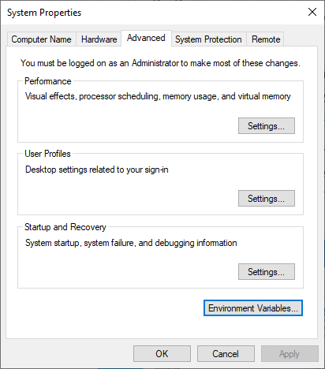
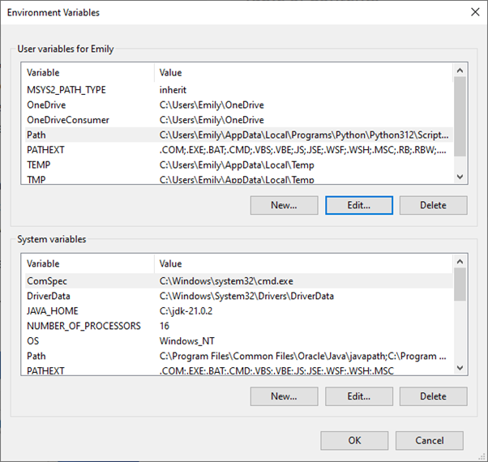
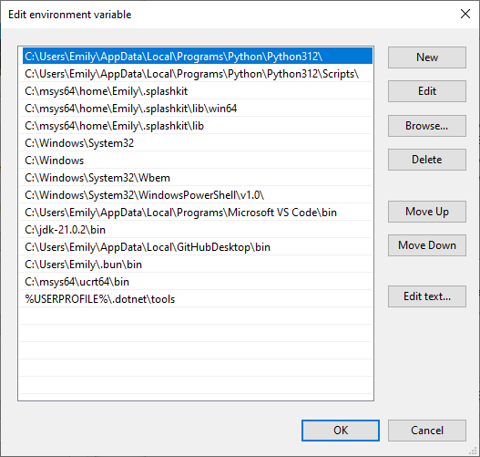
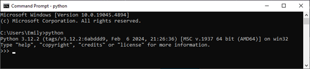

# **Post Tour Reflection Game README**

By Emily Hocking (104554365)

## I. Context

This Python game was created as a way to include my Computer Science degree in my reflection, substituting for around 400 words of the reflection.

The game itself details a series of short maps where a player must order and catch a Grab/Gojek car in Indonesia, with the game maps representing certain locations I encountered in Indonesia.

The project uses Python as its foundational knowledge as well as Pyglet as a rendering library. Originally this game was supposed to be made using C++, however I found that attempting to use SDL to render was becoming a bit too difficult and messy. As such, the game switched to being in Python.

This game should be able to run on any platform, however please ensure you have downloaded Python and Pyglet before attempting to run the game.

YOU DO NOT NEED VISUAL STUDIO CODE TO RUN THE PROJECT AS YOU CAN DO IT IN COMMAND PROMPT

## II. Player Controls

You can move the player entity (the purple square) using the WASD controls and order a car by clicking on the ORDER CAR button.

To reset the current map, you can press the R button.

You win the game when you successfully catch a car in all 3 maps.

You lose the game if you run out of money (by missing too many cars) or reach 100 stress (from hitting too many cars).

## III. Project Structure Details

This Python project features a multitude of files, including:
- Python files found in the base directory (used for processing and coordinating the game),
- The 'window.txt' file found in the game_files directory (used for setting up the parameters for the game window),
- The map files (including the map_list.txt and win.txt) found in the game_files/maps directory (used for defining maps and coordinating gamestate changes),
- The object files found in game_files/maps/presets directory (used to load in shapes for the background and entities)

All Python files feature code comments explaining functions.

Also note that the graphics.py file has been modified and originates from a different unit. It has been used in this project merely for easier control of Pyglet rendering.

## IV. Setting up Python

The following steps must be followed to ensure the project can be ran without errors or issues (this list is for Windows computers):

1.	Download Python from the official python download site (located [here](https://www.python.org/downloads/)). It is advised to download the latest version.  <br><br>

2.	Once Python is downloaded, ensure that it is correctly integrated into the system path. This can be done in the Python download wizard; however, it can also be done manually using the following steps (this assumes Python has not already been linked to PATH):

    1.	Locate the Python executable file explorer location. This will usually be located in AppData in the currently logged-in user. For example, my Python executable is located at: ‘C:\Users\Emily\AppData\Local\Programs\Python\Python312’ however it may slightly vary on your computer depending on your chosen Python version or system configurations.  <br><br>

    2.	Open ‘System Properties’ by typing in ‘Edit the system environment variables’ into your search bar. <br><br>

    3.	In this menu, click on the ‘Environmental Variables’ button to access the environmental variables (see below screenshot).

        

        *Figure 1: Screenshot of System Properties screen*  <br><br>

    4.	Click on the ‘Path’ user variable and select edit (see screenshot below).

        

        *Figure 2: Screenshot of Environment Variables screen*  <br><br>

    5.	Select ‘New’ and enter the path to the Python executable. Once it is added, using the ‘Move Up’ button on the right, move the path to the top of the ‘Path’ paths (see screenshot below).

        

        *Figure 3: Screenshot of adding Python path*  <br><br>

    6.	Confirm Python is now successfully installed and path is configured correctly by opening Command Prompt and entering the command ‘python’. If the Command Prompt registers the command and allows for Python prompts to be entered, then both Python and the Python path have been successfully configured.

        

        *Figure 4: Screenshot of Command Prompt displaying successful Python configuration*  <br><br>

3.	Download the needed python libraries. This can be done in the Command Prompt window via running the command of: ```pip install <library>``` where <library> refers to the python library name. The following libraries need to be downloaded:

    1.	pyglet<br><br>

    You can also quickly download this by running the following section of code:<br><br>

    ``` pip install -r install_requirements.txt ```<br><br>

    This section of code accesses the install_requirements.txt file and downloads the libraries specified in the text file (however in this case there is only one library).<br><br>


4. Now go to the directory of the game files via the cd command in Command Prompt. My path for this is "cd Documents\GitHub\industry_visit_game\", yours will likely be something like "cd Downloads\104554365_Game\" (substitute 104554365_Game with whatever the folder containing the game is).<br><br>

5. Once you are in the directory on Command Prompt, enter the following command: "python main.py" and the game should run!<br><br>

If you are having difficulty running the game, send me a message on WhatsApp or elsewhere and I'll troubleshoot. However the game should work.